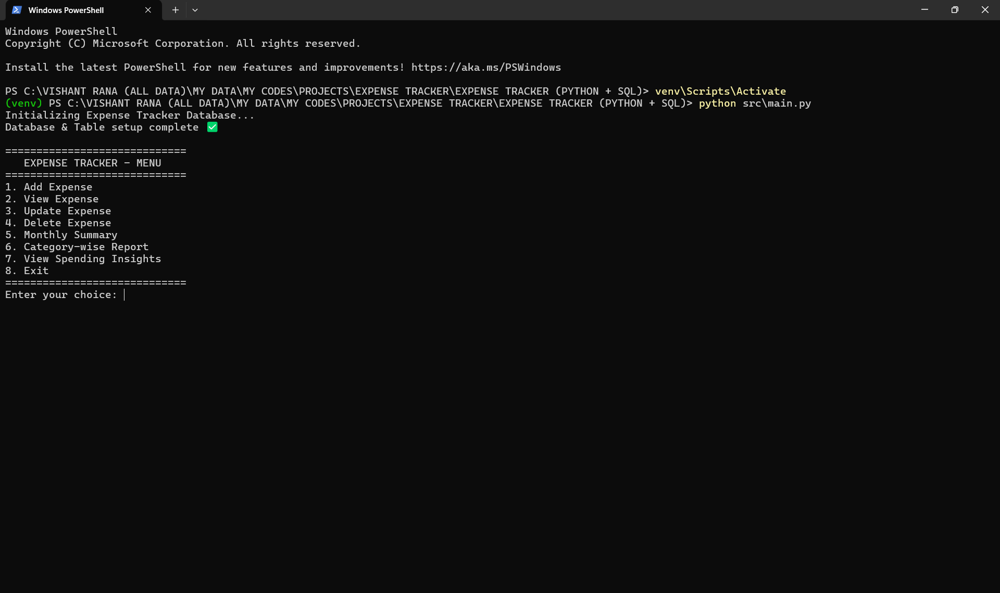
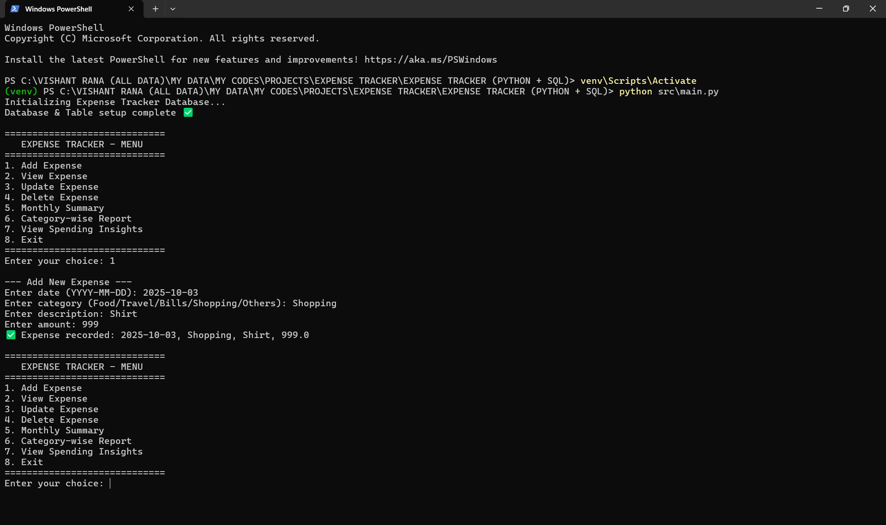
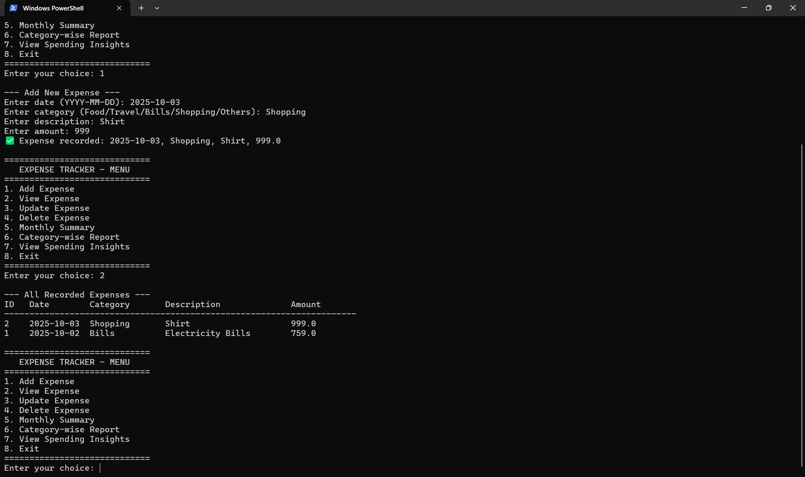
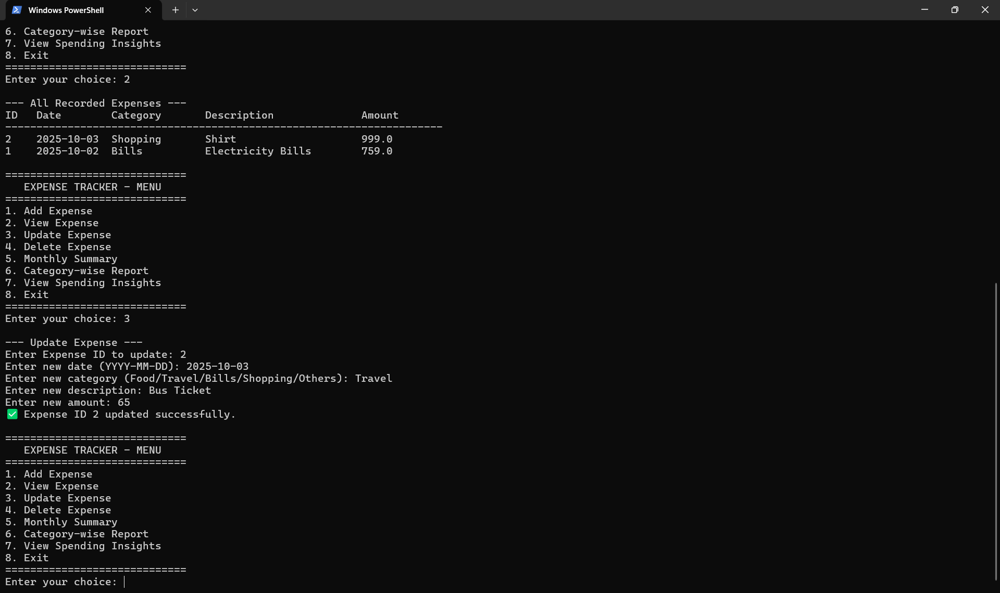
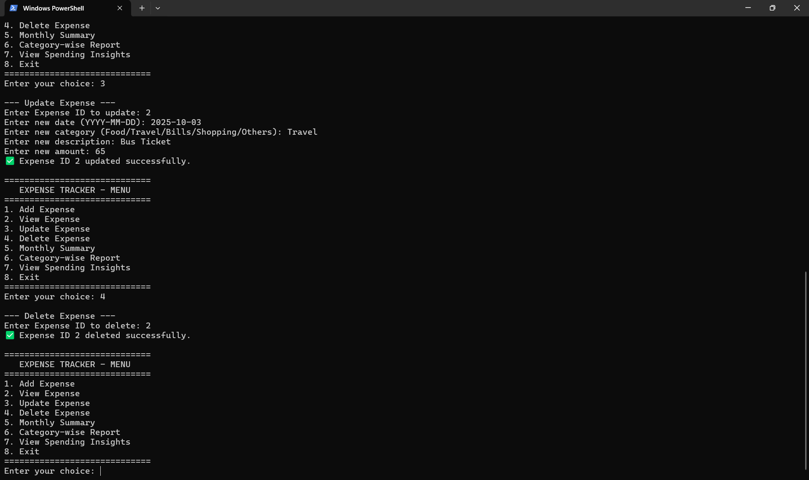
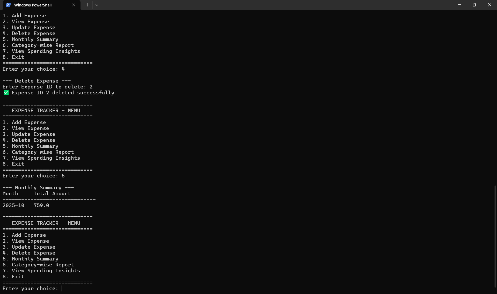
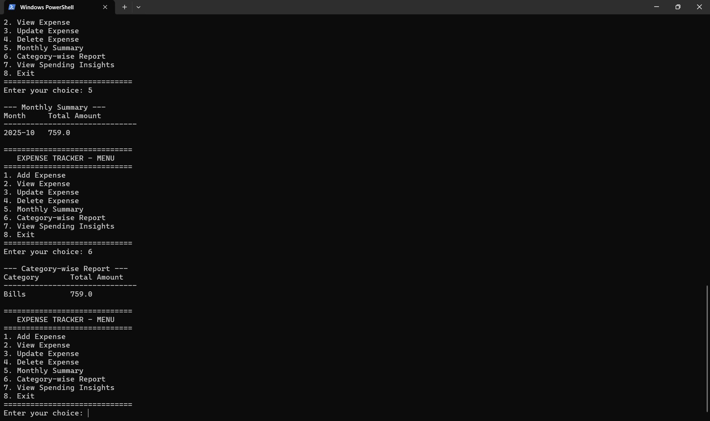
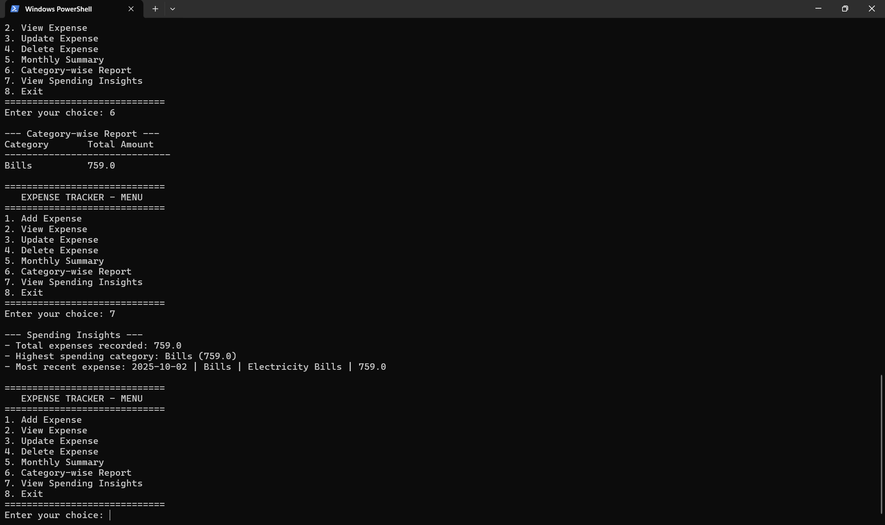
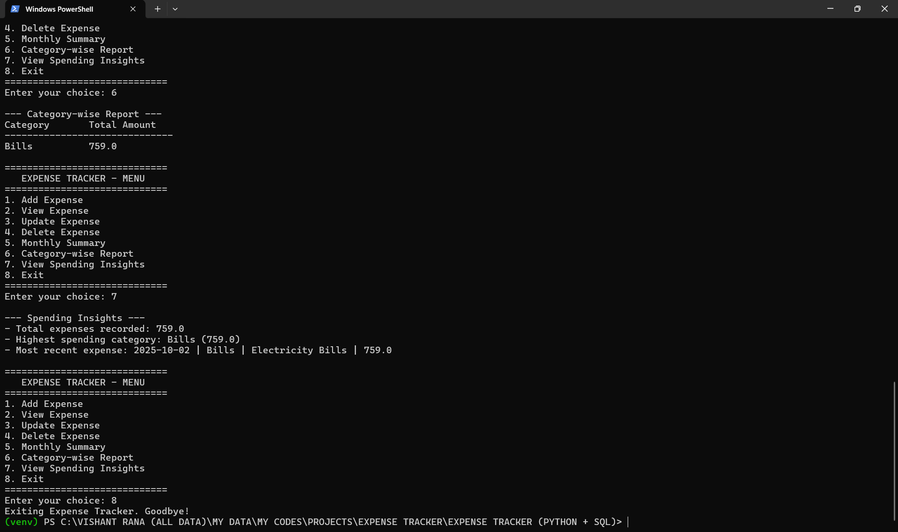

# 📚 Expense Tracker (Python + SQL)

## 📝 Description
A backend application to manage daily expenses using Python and SQLite.  
Supports **CRUD operations**, monthly summaries, category-wise reports, and secure transaction storage.  
Designed with a focus on simplicity, practicality, and insights into spending patterns.

## 🚀 Features
- **CRUD Operations** → Add, View, Update, Delete expenses  
- **Monthly Summary** → Calculate total expenses for a specific month  
- **Category-wise Report** → Track spending per category  
- **SQLite Integration** → Secure storage of expense data in a local `.db` file  
- **Environment Variables** → Database name stored in `.env`  
- **Modular Python Code**:
    * `main.py` → Core CLI application  
    * `db.py` → Database connection & table initialization  
    * `expense_manager.py` → All database operations  

## 📂 Project Structure
EXPENSE_TRACKER/
│
├── src/
│ ├── main.py
│ ├── db.py
│ └── expense_manager.py
│
├── screenshots/
│ ├── 01_main_menu.png
│ ├── 02_add_expense.png
│ ├── 03_view_expenses.png
│ ├── 04_update_expense.png
│ ├── 05_delete_expense.png
│ ├── 06_monthly_summary.png
│ ├── 07_category_report.png
│ ├── 08_view_spending_insights.png
│ └── 09_exit.png
│
├── database/
│ └── expense_tracker.db
│
├── venv/
├── .env
├── .gitignore
├── requirements.txt
└── README.md

**.env file:**
DB_NAME=database/expense_tracker.db

**requirements.txt**
python-dotenv==1.1.1

## ⚙️ Setup & Installation

Step 1 – Clone Repository
git clone git@github.com:vishantrana007/EXPENSE-TRACKER--PYTHON-SQL-.git
cd EXPENSE-TRACKER--PYTHON-SQL-

Step 2 – Create Virtual Environment
python -m venv venv

Step 3 – Activate Virtual Environment
Windows:
venv\Scripts\activate

macOS/Linux:
source venv/bin/activate

Step 4 – Install Dependencies
pip install -r requirements.txt

Step 5 – Setup Environment Variables
Create a .env file in project root with:
DB_NAME=database/expense_tracker.db

Step 6 – Run Application
python src/main.py

## 🖥️ Output Example
=== MAIN MENU ===
1. Add Expense
2. View Expense
3. Update Expense
4. Delete Expense
5. Monthly Summary
6. Category-wise Report
7. View Spending Insights
8. Exit
=== ADD EXPENSE ===
Enter date (YYYY-MM-DD): 2025-10-02
Enter category (Food/Travel/Bills/Shopping/Others): Food
Enter description: Coffee
Enter amount: 150
✅ Expense recorded: 2025-10-02, Food, Coffee, 150
=== VIEW EXPENSES ===
ID | Date       | Category | Description | Amount
1  | 2025-10-02 | Food     | Coffee      | 150.0
=== MONTHLY SUMMARY ===
Month     | Total Amount
2025-10   | 150.0
=== CATEGORY-WISE REPORT ===
Category | Total Amount
Food     | 150.0
=== SPENDING INSIGHTS ===
- Total expenses recorded: 150.0
- Highest spending category: Food (150.0)
- Most recent expense: 2025-10-02 | Food | Coffee | 150.0

## 📸 Screenshots
Main Menu  
  

Add Expense  
  

View Expenses  
  

Update Expense  
  

Delete Expense  
  

Monthly Summary  
  

Category-wise Report  
  

View Spending Insights  
  

Exit Application  
  

## 📝 Notes
1. Ensure SQLite database file exists in /database folder before running scripts.
2. Database name is configurable via .env file.
3. Screenshots are in /screenshots folder for reference.
4. Use virtual environment for dependency management.
